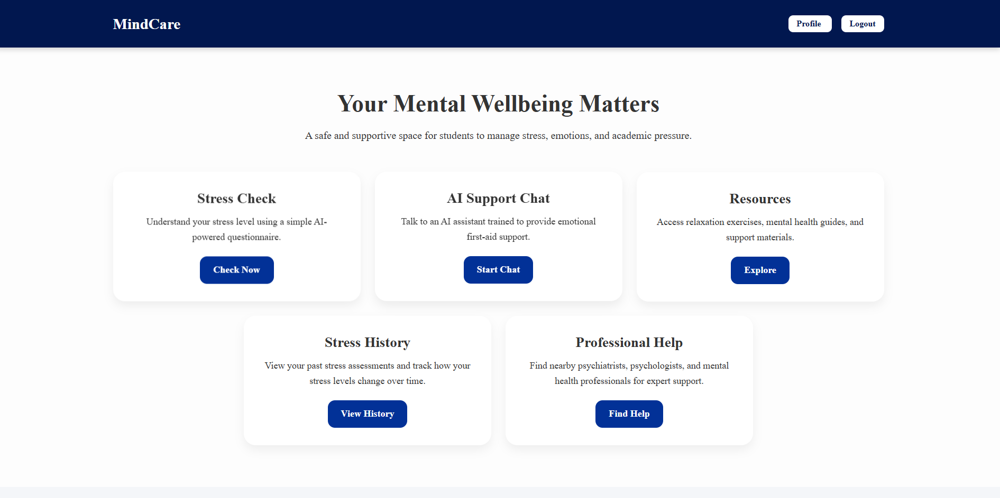
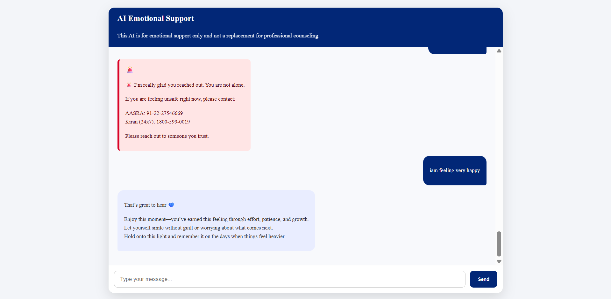
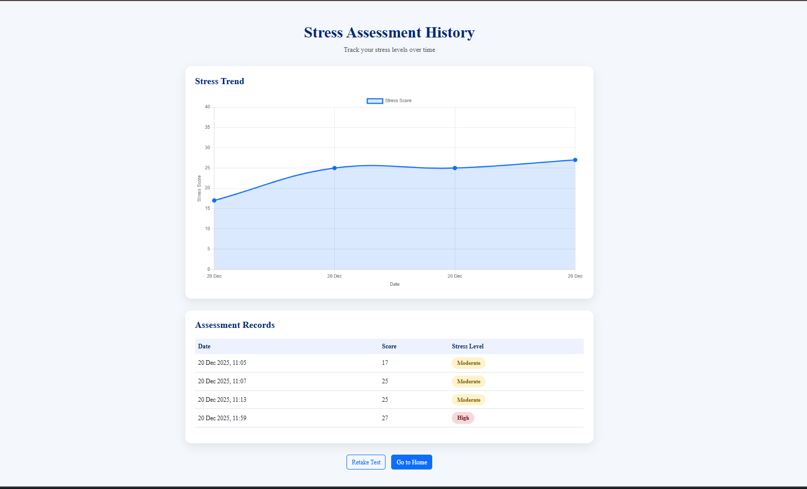
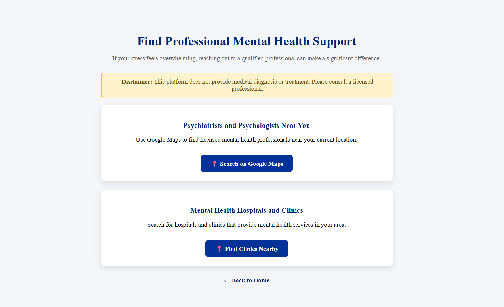
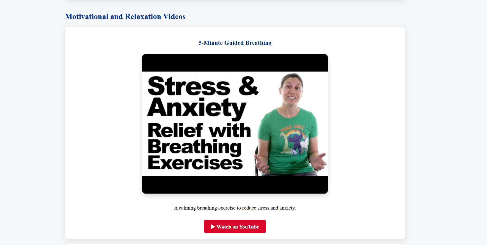

#  Digital Mental Health Support System

A **web-based mental health support platform** designed to help students **assess stress levels**, **track mental well-being over time**, and **receive emotional support** using **machine learning–based sentiment analysis** and **interactive visualizations**.

>  **Disclaimer:** This platform is intended for self-help and awareness purposes only and is **not a replacement for professional mental health care**.

---

##  Project Overview

The *Digital Mental Health Support System* addresses increasing academic stress among students by providing a structured stress assessment, long-term stress tracking, and an AI-assisted emotional support interface.  
The system focuses on *self-awareness, early detection, and ethical AI usage, while clearly stating that it is **not a replacement for professional mental health care*.

The system emphasizes:
- Self-awareness  
- Early stress detection  
- Ethical and responsible AI usage  

Clear disclaimers and crisis-handling mechanisms are integrated to ensure user safety and transparency.

---

## Objectives

- Assess user stress levels using standardized questionnaires  
- Analyze emotional sentiment using machine learning techniques  
- Track stress trends over time with visual analytics  
- Provide ethical AI-based emotional support  
- Promote mental health awareness among students  

---

##  Technology Stack

### Frontend
- HTML5  
- CSS3  
- JavaScript  

### Backend
- Python  
- Django Framework  

### Database
- SQLite (Django default database)

### Machine Learning
- Scikit-learn  
- Naive Bayes Classifier  
- TF-IDF Vectorization  

### Data Visualization
- Chart.js  

---

##  Core Features

###  User Authentication
- Secure login and logout  
- User-specific data isolation  
- Protected access to sensitive pages  

###  Stress Assessment
- Questionnaire-based stress evaluation  
- Automatic score calculation  
- Stress level classification (Low / Moderate / High)  

###  Stress History & Visualization
- Stores all past stress assessments with timestamps  
- Line graph visualization using Chart.js  
- Helps users identify long-term stress patterns  

###  AI Emotional Support Chat
- Machine learning–based sentiment analysis  
- Message classification: Positive / Neutral / Negative  
- Crisis detection with alert-based UI  
- Ethical disclaimer clearly displayed  

###  User Profile Management
- Editable personal details (Full Name, Date of Birth, Profession)  
- Profile avatar support (image or auto-generated letter avatar)  
- Controlled edit → save workflow  
- Stress summary shown on profile page  

---

##  Machine Learning Usage

### Algorithm Used: **Naive Bayes Classifier**

The Naive Bayes classifier is used for **sentiment analysis** in the AI emotional support chat.

**Why Naive Bayes?**
- Efficient for text classification  
- Lightweight and fast  
- Performs well on small datasets  
- Easy integration with web applications  

**Sentiment Categories:**
- Positive  
- Neutral  
- Negative  

Used for:
- AI chat responses  
- Crisis detection  
- Emotional trend understanding  

---

##  Data Visualization

- Stress scores plotted over time using Chart.js  
- Line charts resemble trend analysis graphs  
- Improves clarity and user self-awareness  

---

##  Error Handling & Reliability

Handles:
- Missing user profiles  
- Invalid or empty inputs  
- Incomplete submissions  
- Database inconsistencies  
- Template rendering errors  

Techniques:
- Server-side validation  
- Conditional rendering  
- Defensive programming  
- Django error tracing  

---

##  Security Measures

- Authentication required for sensitive pages  
- CSRF protection enabled  
- User-specific data access control  
- No exposure of ML internals or sensitive data  

---

##  Screenshots

###  Home Dashboard

###  AI Emotional Support Chat

###  Stress Assessment History

###  Professional Mental Health Support

###  Wellness Resources

---

##  Advantages

- Cost-effective and lightweight  
- Real machine learning integration  
- Ethical and responsible AI usage  
- Clean, professional UI  
- Scalable and maintainable architecture  
- Suitable for academic and real-world demos  

---

##  Limitations

- Not a substitute for professional mental health treatment  
- Uses classical machine learning (not deep learning)  
- Stress assessment is self-reported  
- Requires internet access  

---

##  Author
 
Dharani - Dharani373
